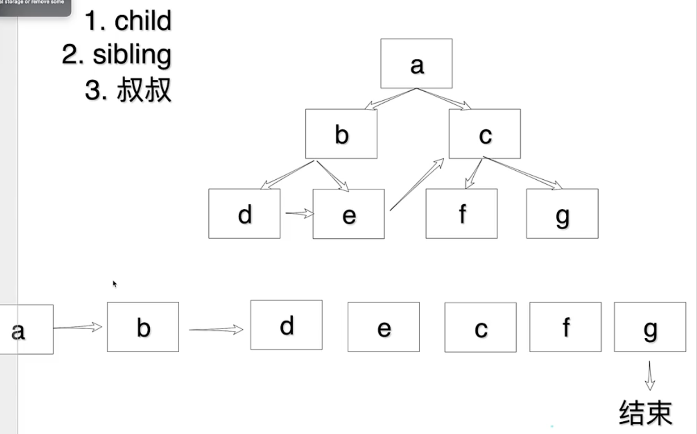

我们的目标是将 DOM 树拆分成若干个小的任务，任务依次执行，因此选用 linkedList 作为存储每个任务（渲染一个 DOM）得到一个执行任务队列，因此需要将整棵树转化成一个链表，显而易见是个遍历问题，采用前序遍历

边构建链表关系，边渲染 dom：

1.child 孩子
2.sibling 兄弟
3.parent.sibling 叔叔

1.创建 DOM

2.设置 props

3.转换列表，设置指针

4.返回下一个要执行的任务

问题：如果执行完一部分任务之后，没有剩余时间了，当前实现的 fiber 架构的任务执行机制将使得剩余任务过很久才能执行，怎么解决？

# 思考

今天最大的收获就是“化整为零”思想的实践——在庞大任务场景中应该注意任务、概念的划分，比如：

1.庞大的计算或者渲染任务的执行：除了之前用过的 worker，还可以用今天学到的 requestIdleCallback 来利用浏览器空余时间执行任务，这对我今后的学习研究是很有帮助的。
比如在重构一个 svg 可视化框架的时候，也可以利用今天的 fiber 思想将 svg 的图元渲染任务分散在空闲时间片内

2.函数应封装成最小粒度：凡是可以用一句话总结概括其功能的代码段都可以被拆分成一个函数

3.函数设计时的功能描述和拆分对逻辑要求较高，相比于先实现细节再拼装函数，这种方式提供了高屋建瓴的视角，在今后的学习中我也需要多写这种 comment
