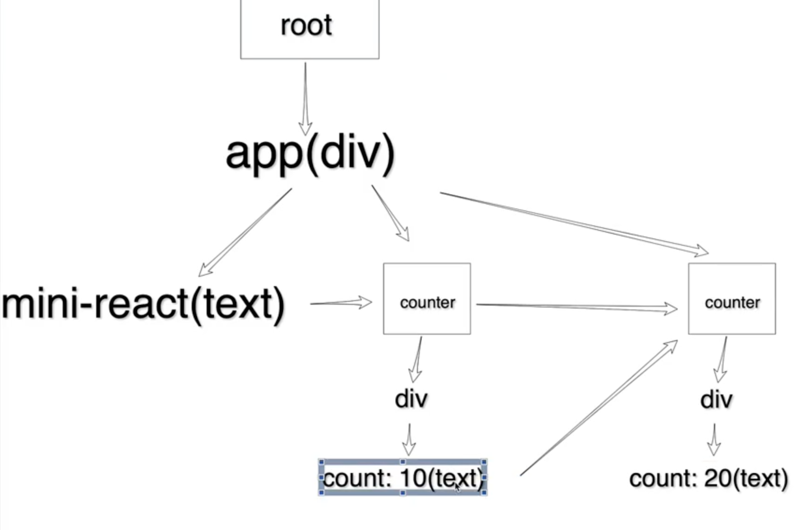
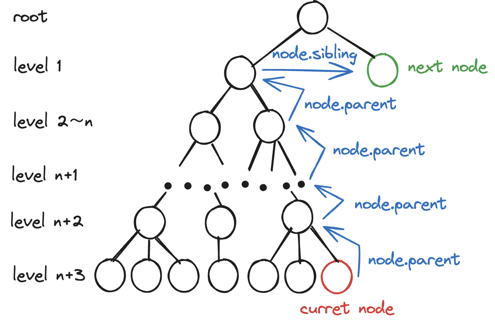

# 问题 1:function component 的识别解析和处理

## 原因分析

1.type 为 function，该函数运行的结果是一个 dom 对象

2.对函数 fiber 处理的时候没有创建 dom 节点，导致函数组件里面的 dom 会找不到 parent.dom

## 解决思路

1.对 function component 和 host component 进行不同处理，前者处理 children 的时候要执行 fiber.type()并将对象数组化包装

2.利用 while 循环向上一直找 parent，直到找到一个可用 parent.dom 的为止

# 问题 2:props 胡子语法传入 number

## 原因分析

如果直接给 function 传一个 props 并且让它以胡子语法渲染出来，可以发现控制台报错，这是因为 function 没有接收到 props，需要在递归处理 children 的时候，运行函数时传入参数 fiber.type(fiber.props)

## 解决思路

之前处理的时候已经考虑到了 react 可以正常显示 string number 而不能显示 true false undefined null，所以在处理 children 时候执行 fiber.type(fiber.props)可以正常创建节点

# 问题 3:对于挂载在 app 上的多个组件，只能显示一部分

## 原因分析：

原来的微任务队列在返回下一个任务时没有考虑到深层节点会一直向上寻找父节点的兄弟节点（叔叔、曾叔叔...），只是简单地考虑了一层（叔叔），对于下面的情况，最终返回的是 null，队列终止，其他组件内容不再渲染

```js
// 4.返回下一个要执行的任务
if (fiber.child) {
  return fiber.child;
}
if (fiber.sibling) {
  return fiber.sibling;
}
return fiberParent.sibling;
```



## 解决思路：

向上一直查找直到返回下一个 fiber

需要注意对于 dom 树的最后一个节点，fiberParent 一直向上查找到 root 仍然需要查找 root.parent

但是 root 只有 child 没有 parent 和 sibling 所以查找结果为 undefined，fiberParent 被更新成 undefined

此时无需继续查，直接返回 null 标志着任务结束，全局的 nextWorkOfUnit 被重置为 null



```js
// 4.返回下一个要执行的任务
if (fiber.child) {
  return fiber.child;
}
if (fiber.sibling) {
  return fiber.sibling;
}
// 向上一直查找直到返回下一个fiber
// 需要注意对于dom树的最后一个节点，fiberParent一直向上查找到root仍然需要查找root.parent
// 但是root只有child没有parent和sibling所以查找结果为undefined，fiberParent被更新成undefined
// 此时无需继续查，直接返回null标志着任务结束，全局的nextWorkOfUnit被重置为null
let fiberParent = fiber.parent;
while (fiberParent && !fiberParent?.sibling) {
  fiberParent = fiberParent.parent;
}
```

```jsx
if (fiber.child) {
  return fiber.child;
}
let nextFiber = fiber;
while (nextFiber) {
  if (nextFiber.sibling) {
    return nextFiber.sibling;
  }
  nextFiber = nextFiber.parent;
}
```

# 思考重构：处理 function component 和正常节点的时候走不同的函数，从 performWorkOfUnit 中抽离出清晰的逻辑，重构是贯穿整个开发周期的任务！
