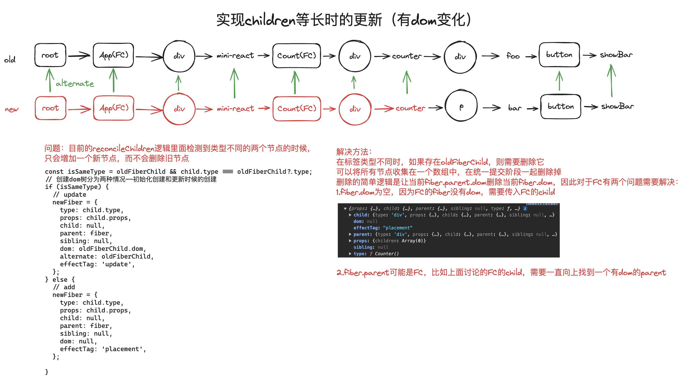
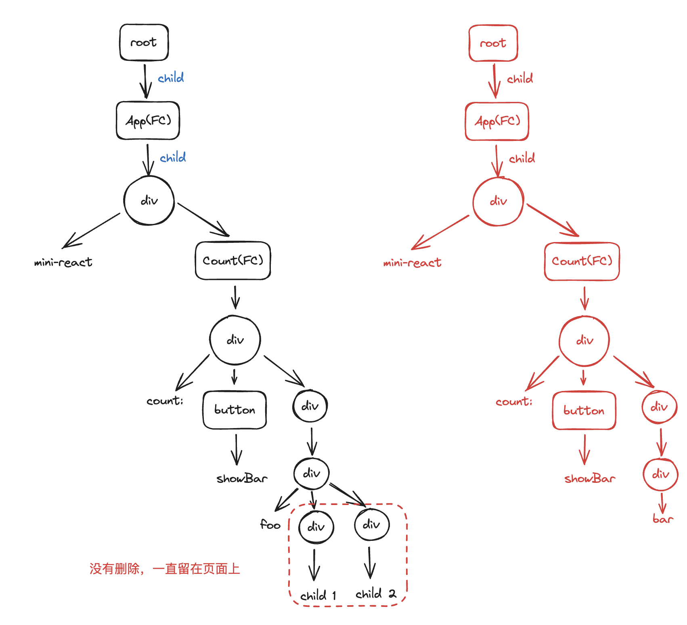
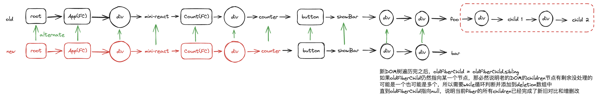

# 问题一：children 数量相同、链表等长时候的更新



# 问题二：children 数量不相同、链表不等长时候的更新





# corner case 1 胡子表达式中嵌入 false

## 问题

false 后的内容都无法正常渲染

## 原因分析

在 createElement 处理 children 的时候，遇到 false 直接会将其作为一个 item 放在 children 数组中

## 解决方法

处理 children 的时候，只有 child 不为 false 的时候才创建 newFiber

# corner case 2 胡子表达式中嵌入 false 且不是最后一个 child

## 问题

胡子表达式后面的一个 child 在处理 newFiber 的时候，prevChild 报错

## 原因分析

showBar 为 false，在 case1 的处理中没有创建对应的 fiber，但是在本次处理的末尾，prevChild = newFiber，newFiber 为 undefined。
在它的 sibling 的处理过程中又获取 undefined 的 sibling 属性`prevChild.sibling = newFiber; `因此报错，

## 解决方法

加上判断即可

```js
if (newFiber) {
  prevChild = newFiber;
}
```
