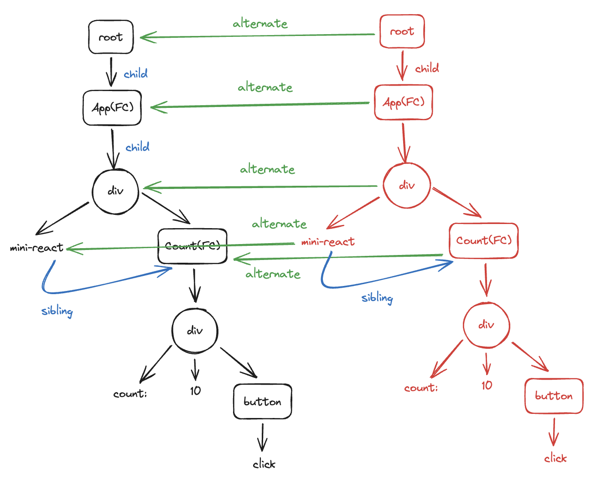
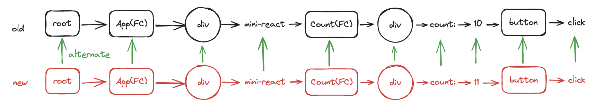
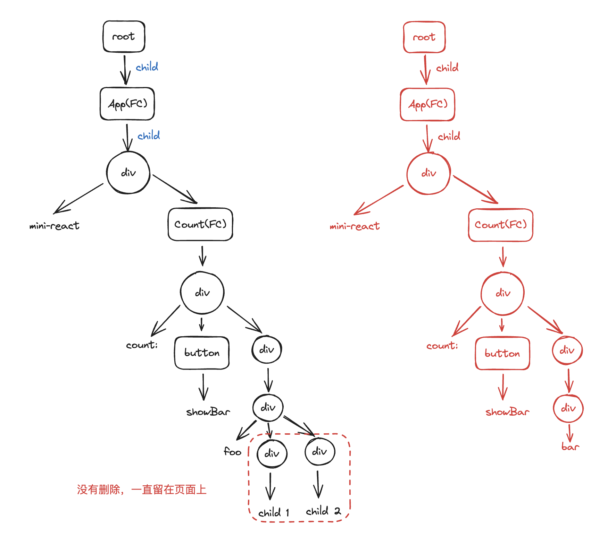
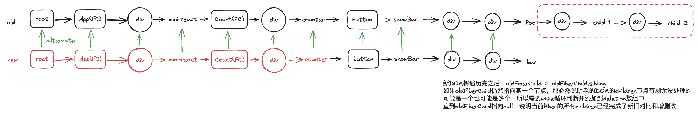
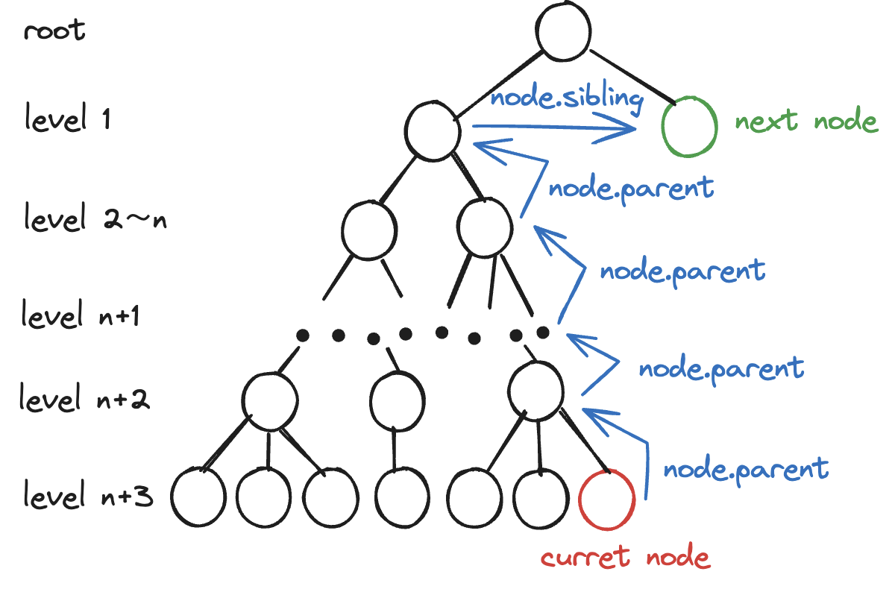

# 前言

本文是我参与<a href="https://github.com/cuixiaorui">崔大</a>发起的“mini-react 游戏副本”完整课程后的思路总结、技巧收获总结以及心得感悟。

思路总结重在阐述解决的问题和实现的大致思路，具体代码和详细的工作流程解释可见https://github.com/hugtyftg/mini-react。

技巧收获重在分享令我醍醐灌顶的方法和技巧。

心得感悟重在记录我在整个学习过程中的感受和自我审视。

# mini-react 实现思路总结

## jsx 到 vdom 的转换

react 中的 jsx 语法本质上是 createElement 的语法糖，在 vite 中，esbuild 自动寻找当前引入的 React 模块中的 createElement 函数，将 jsx 语法用该函数解析为 vdom。

react 将除了标签本身的所有内容都看作 props，因此，vdom 的基本结构如下：

```ts
interface VirtualDOM {
  type: 'string';
  props: {
    children: VirtualDOM[] | [];
    [prop: string]: any;
  };
}
```

vdom 按照内容可以粗浅分为两类，一种是没有实际文本内容标签构成的元素节点，另一类是现实文本内容的文本节点，因此 createElement 函数要兼容这两种情况。

## vdom 渲染为真实 DOM

渲染过程可以抽象成 3 个步骤

1. 创建 dom
2. 设置 props
3. 添加 dom

在每一步内具体考虑实现细节，比如 dom 创建时候要根据 vdom 的 type，props 要分成 children、style 和剩余 props 这三种情况处理

## 微任务拆分调度

对于浏览器中 JS 单线程执行的工作方式而言，一旦 DOM 树过于复杂，就会出现严重的界面渲染卡顿。

为了解决这一问题，我们可以把渲染整棵树这样的宏观庞大任务拆分成多个以渲染单 DOM 为目标的微任务，将微任务塞到浏览器的空闲时间内依次执行，充分利用计算资源。这就意味着要将非线形的 DOM 树形结构转换成一个线性的微任务执行队列，执行完一个任务之后返回下一个任务。因此选用链表，基于每个 vdom 节点创建微任务的执行单元——fiber，采用 child -> sibling -uncle 这种类似树的深度优先前序遍历的顺序将 DOM 树转换成一个 fiber 队列，在浏览器空余时间内不断地执行任务、返回下一个任务直至终结。

## 统一提交

我们拆分出来的微任务会在浏览器的每个空闲时间片内执行，但如果在一个空闲时间片内，当前任务没有完全完成、dom 节点没有彻底创建完毕的时候，空闲时间就已经使用殆尽，任务就此中断。只有过了一段时间、到了下一次出现空闲时间片的时候，才会再次执行上次的遗留任务。这样一来，用户只会看到界面只出现一部分 DOM 而不是完整的 DOM，过了一段时间后才会陆续出现其他 DOM，也就是前端视觉卡顿。

该问题的本质是浏览器内核在执行任务的过程中具有异步性，以一种不可预知的速度执行每一个任务，因此空闲时间的出现以及对应 callback 的调用也是不可预估、时有时无的。如果在这样的时间内安排视觉呈现的工作，难免会出现断断续续的卡顿渲染，正如 MDN 官方文档对该 api 的注解一样：

<a href="https://developer.mozilla.org/zh-CN/docs/Web/API/Background_Tasks_API#%E5%85%85%E5%88%86%E5%88%A9%E7%94%A8%E7%A9%BA%E9%97%B2%E5%9B%9E%E8%B0%83">**避免在空闲回调中改变 DOM**。空闲回调执行的时候，当前帧已经结束绘制了，所有布局的更新和计算也已经完成。如果你做的改变影响了布局，你可能会强制停止浏览器并重新计算，而从另一方面来看，这是不必要的。如果你的回调需要改变 DOM，它应该使用 Window.requestAnimationFrame() 来调度它。</a>

因此只需要在这些时间片内进行计算工作，在链表计算处理结束的时候统一提交、执行真实 dom 的挂载即可。

## 函数组件的解析和处理

函数组件本质上是一个函数，执行函数组件的过程就是执行该函数的过程。函数组件没有具体意义，更像是一个需要“打开的盒子”，只有运行函数、打开盒子之后，我们才能得到想要的 dom 元素，所以对于没有盒子包裹的普通组件和有盒子包裹的函数组件在处理时并不相同：

前者在没有 dom 时候可以创建 dom、设置非 props 的属性、对 children 递归处理，而后者因为自身无实意，只能递归处理 children，并且需要通过`[fiber.type(props)]`才能得到 children 数组。

FC fiber 没有创建 dom 这一点为 fiber 任务执行过程中统一提交时挂载 DOM 的逻辑埋下隐患：

1. 没有 dom 无法挂载
2. 没有 dom，不能作为 parent 被其他 dom 挂载

处理方式为：

1. 有 dom 的 fiber 才会挂载到 parent.dom 上
2. parent.dom 为空时一直向上寻找，直到有 dom 为止

## 更新 props

更新 props 意味着创建一棵新的 vdom 树，将新旧节点一一对比，再处理新旧不同的情况（仅仅考虑 dom 树的属性变化）。

### 如何在不再次传入 el 和 container 的前提下重建 vdom 树呢？

显而易见，在 render 的统一提交阶段结束之后保存 root 即可。

### 如何对比新旧节点？

之前保存的 root 实际上也是旧 DOM 的 root，因此在构建新 vdom 树、构建新 fiber 微任务队列的时候，同样递归遍历旧的 vdom 树、旧的 fiber 任务队列，通过 alternate 指针将新旧节点联系起来即可（这里考虑的新旧 vdom 树没有节点的变化，仅仅是属性的变化）。

并且可以在递归处理 children 的时候，根据 fiber.alternate.child 是否为空判断当前是初始化渲染阶段还是更新阶段，并分别给创建出来的 fiber 添加 placement 或 update 的 effectTag 标记，方便 diff props 处理。





### diff props

在边创建新 fiber 边构建 alternate 的过程中，对比 props 会出现三种情况：

1. old 有 new 没有 删除
2. new 有 old 没有 添加
3. new 有 old 有 值不同 更新

后两种情况可以何必为一种：new 有 old 有，值不同，更新（old 没有改 prop 的话，取值结果是 undefined）。这三种情况通过分别遍历一次新旧 props 即可完成

在统一提交阶段已经执行了 dom 的挂载，同理，diff props 也应该在 commit 阶段执行。根据 fiber.effectTag，如果 placement 则说明是初始化渲染阶段，应该执行挂载 dom 的任务；如果是 update 说明是更新阶段，更新 props 即可。

## 性能优化——更新 props 应该“指哪打哪”而非“从头再来”

当前的更新逻辑是根据保存的 root 再重新创建一次树，但是就算某一个子组件没有更新（没有使用其他组件传来的、会发生变化的 prop，并且自身确实也没有更新），对应的子树还是会重新创建。最终某个子组件的更新引起了整个 app 的重新执行，造成巨大的计算资源浪费。

因此在更新时应该重新构建的仅仅是发生变化的函数组件所对应的子树，**起点为 FC fiber，终点为 FC 的最后一个节点，也就是 FC fiber 的 sibling**。

### 起点是通过闭包保存的 FC fiber

正是由于函数组件具有需要执行的特点，我们可以将更新的粒度缩小到每个 FC，在 fiber 微任务队列执行到当前 FC 所在的 fiber 时（进入 handleFunctionComponent 时），可以使用闭包获取当前组件的 fiber，以便作为下一次使用（也就是更新时）的起点。

### 结束点无疑是更新起点 FC fiber.sibling

在兄弟存在的情况下，如果下一个要执行的 fiber 就是兄弟，那么应该立即停止更新，将 nextWorkOfUnit 设置为 undefined 即可终止；如果兄弟不存在，nextWorkOfUnit 也会是 undefined，也会终止。

## 更新 children

上面的更新只考虑了新旧 dom 树没有 dom 增删变化、只有除 children 外的 props 的变化的情况，涉及到 children 的变化可能有两种情况：

1. children 节点总数没有变化，新旧 fiber 队列等长（比如少了一个 div，多了一个 p）
2. children 节点总数发生变化，新旧 fiber 队列不等长（最常见）

### 新旧 fiber 队列等长度


按照原先的逻辑，如果监测到新旧节点 type 不同的时候，认为当前处在初始更新阶段，因此添加新节点，而没有删除旧节点。这样潦草的判断在哪里自相矛盾呢？

对了，如果真的认为是初始化更新，oldFiberChild 就应该为空值，但是显然并不为空值。所以可以在新旧节点不同内再根据 oldFiberChild 是否为空，判断当前是真的 placement，还是有 dom 变化的 update。对于前者，现在的统一提交处理已经足够了，对于后者，统一提交前还需要删除旧节点。

这个功能的实现过程是螺旋上升的，具体可见<a href="#开发三驾马车之一按图索骥实现基础功能">开发三驾马车</a>中的叙述

### 新旧 fiber 队列不等长度





forEach 遍历新 vdom 树的时候 oldFiberChild 也会更新（重新指向 oldFiberChild.sibling）

如果新旧子树相同，forEach 结束时，oldFiberChild.sibling 为 undefined，oldFiberChild 被更改为 undefined。

但是如果 oldFiberChild 仍不为 undefined，说明新旧子树并不相同，多余的子树需要在统一提交阶段被删除。

## useState

### 基本实现

```js
function useState(initial) {
  // state
  let stateHook = {
    state: initial,
  };
  function setState(action) {
    // 修改state
    stateHook.state = action(stateHook.state);
    // 给wipRoot重新赋值，推动requestIdleCallback(workLoop)重新生成一棵DOM树，从而更新视图
    // currentFiber为微任务队列执行到这个FC fiber时通过wipFiber获取到的闭包
    wipRoot = {
      ...currentFiber,
      alternate: currentFiber,
    };
    nextWorkOfUnit = wipRoot;
  }
  return [stateHook.state, setState];
}
```

### 实现 action 为函数的 useState

但是这样做有一个问题，在初始渲染的时候调用了一次 useState，此时的 stateHook 值是 initial，setState 通过闭包拿到的 state 也是 initial。

在下一次调用 setState、requestIdleCallback 开始工作、更新视图的时候，会再次执行当前的 FC 组件，在再次调用 useState，但是 state 的值还是 initial，因此视图无法更新。

如果想要视图更新，需要获取到当前 FC 的 fiber 在上一个时间片中的 state 值，据此更新视图

```js
function useState(initial) {
  // 使用闭包暂时存储这个useState所在的FC的fiber
  let currentFiber = wipFiber;
  // 通过alternate指针将两个闭包里面的fiber联系起来。
  let oldFiberHook = currentFiber.alternate?.stateHook;
  const stateHook = {
    state: oldFiberHook ? oldFiberHook.state : initial,
  };
  currentFiber.stateHook = stateHook;

  function setState(action) {
    // 给wipRoot赋值，开启创建新fiber的流程
    stateHook.state = action(stateHook.state);
    wipRoot = {
      ...currentFiber,
      alternate: currentFiber,
    };
    nextWorkOfUnit = wipRoot;
  }
  return [stateHook.state, setState];
}
```

对于初始化阶段，当 work 执行到 FC 对应的 fiber 的时候，执行 fiber.type(fiber.props)，也就是自上而下地执行了这个 FC 对应的函数。useState 第一次被执行，此时所有 fiber 都没有 alternate，因此 oldFiberHook 为 undefined，stateHook 赋值的时候采用初始值，当前 FC 所对应的老的 fiber 添加了 stateHook 属性，此时的闭包（函数执行期上下文）记作 EC1，产生的 setState 引用的变量也是在 EC1 内

在某个时刻调用 setState 之后，EC1 闭包中的 state 值被更新，wipRoot 被赋值，workLoop 自动开始执行。当再次执行到这个 FC 时，通过 fiber.type(fiber.props)又运行了一次 useState，这个时候创建出来了 EC2，state 通过 alternate 被更新为 FC fiber 的 EC1 中的值，也就是刚刚触发的 action 的对 state 的更新结果，并将 EC2 中的 state 返回给 FC，FC 中 jsx 引用的 state 也更新为 EC2 中的值。

EC2 返回的 setState 函数等待下一次调用它的时刻，重复着修改 EC2 state -> 重新构建 fiber 链表 -> 处理 FC -> fiber.type(fiber.props) -> 执行 useState -> 返回 EC3 的 set -> ... 循环往复

### 一个 FC 存储多个 state

如果只是用一个变量保存的话，前面的 state 会被后面的 state 覆盖，所以需要使用数组存储一个 FC 内的所有 state。由于一个应用里面有很多个 FC，每个 FC 有很多个 state，第一反应是直接在全局使用一个二维数组保存每个 n FC \* m state，但是，每个 FC 想知道的仅仅是它自身在之前的 state，而不关心其他 FC，并且我们已经通过了上面的机制拿到了每个 FC 对应的闭包，所以使用庞大的二维表是完全没有必要的，应该在全局声明 stateHooks 和 stateHookIndex 两个变量，在每个 FC 对应的 fiber 闭包中初始化赋值为[]和 0

### 批处理更新

上面的逻辑其实有一个很怪的点——setState 的时候，拿到了老 EC 闭包中的值，直接同步更新老的值，然后开始重新构建 DOM 树和 fiber 链表，再次进入 FC 函数，在第二次调用 FC 产生的闭包里面再次执行 useState 的时候，从老 EC 里面拿新值，这样非常不合理，为什么不能在新 EC 里面通过老 EC 的旧值算出新值呢，并且这样的同步修改方式在大量 setState 的时候，明明只需要最终更新一次视图，却因为中间产生了若干中间值而进行了多次不必要的更新。

解决方法：不同步更新，将所有 action 收集起来放到 updaterQueue 里面，在调用 setState 后再次进入 FC 的 useState 闭包时批量调用，调用完成之后才更新视图。视图只更新一次，提高更新效率

## useEffect

### 实现基本的 init 之后调用 effect

useEffect 调用时机是 React 渲染真实 DOM 之后，并且浏览器完成重新绘制之前

和 useState 类似，给每个 wipFiber 挂载 effectHook，用以保存副作用

```js
function useEffect(callback, deps) {
  let effectHook = {
    callback,
    deps,
  };
  wipFiber.effectHook = effectHook;
}
```

react 渲染完毕真实 DOM 的时机，即 commitRoot 统一提交中 commitWork 执行完毕的时候，递归遍历所有 fiber，调用绑定在它们身上的副作用方法

```js
function commitRoot() {
  deletions.forEach(commitDeletion);
  commitWork(wipRoot.child);
  // 统一提交之后开启副作用
  commitEffect();
  currentRoot = wipRoot;
  // 重置当前活动的fiber
  wipRoot = null;
  // 重置需要删除的fiber
  deletions = [];
}
```

### 监听 deps，初始化和更新的时候执行副作用

初始化的时候执行所有的 effect，更新的时候需要判断 deps 是否改变，再确定执行什么 effect，涉及到两个问题

1. 如何区分初始化和更新阶段：wipFiber.alternate 是否有值
2. 更新阶段如何判断 deps 是否改变：some 比较新旧 deps 确定是否有依赖项变化，若变化则调用 callback

```js
function commitEffect() {
  function run(fiber) {
    // 出口
    if (!fiber) {
      return;
    }

    // 根据是否有alternate判断当前阶段是初始化还是update
    if (!fiber.alternate) {
      // init，直接执行所有的副作用
      fiber.effectHook?.callback();
    } else {
      // update，deps发生变化的时候才执行副作用
      // 有的fiber可能没有使用useEffect，没有effectHook属性，所以用可选链
      const oldEffectHook = fiber.alternate?.effectHook;
      const curEffectHook = fiber?.effectHook;
      // deps数组内的item只要有一项发生变化，则开启副作用
      const needUpdate = oldEffectHook?.deps.some((oldDep, index) => {
        return oldDep !== curEffectHook?.deps[index];
      });
      if (needUpdate) {
        curEffectHook.callback();
      }
    }

    run(fiber.child);
    run(fiber.sibling);
  }
  run(wipFiber);
}
```

### 多个副作用

和 useState 的处理方式相同，也需要在全局定义一个收集所有 effect 的变量 effectHooks。

```js
let effectHooks;
```

在进入 FC 的时候 effectHooks 初始化为数组

```js
// 处理函数组件
function handleFunctionComponent(fiber) {
  // 存储将来要更新的FC fiber
  wipFiber = fiber;
  // 初始化当前fiber在当前闭包中的stateHooks和对应的index
  stateHookIndex = 0;
  stateHooks = [];
  // 初始化副作用
  effectHooks = [];
  const children = [fiber.type(fiber.props)];
  reconcileChildren(fiber, children);
}
```

在调用 useEffect 的时候把所有的 callback 和 deps 收集到 wipFiber.effectHooks 里面。

```js
function useEffect(callback, deps) {
  let effectHook = {
    callback,
    deps,
  };
  effectHooks.push(effectHook);
  wipFiber.effectHooks = effectHooks;
}
```

在统一处理 effectHooks 的时候分情况（init update）遍历处理所有的 effectHook。

```js
// 根据是否有alternate判断当前阶段是初始化还是update
if (!fiber.alternate) {
  // init，直接执行所有的副作用
  fiber.effectHooks?.forEach((effectHook) => {
    effectHook?.callback();
  });
} else {
  // update，deps发生变化的时候才执行副作用
  fiber.effectHooks?.forEach((hook, index) => {
    // 有的fiber可能没有使用useEffect，没有effectHook属性，所以用可选链
    const oldEffectHook = fiber.alternate?.effectHooks[index];
    const curEffectHook = hook;
    // deps数组内的item只要有一项发生变化，则开启副作用
    const needUpdate = oldEffectHook?.deps.some((oldDep, i) => {
      return oldDep !== curEffectHook?.deps[i];
    });
    if (needUpdate) {
      curEffectHook.callback();
    }
  });
}
```

### cleanup

#### 存储

一个 FC fiber 应该使用数组存储内含的多个 useEffect item，而一个 useEffect item 应该存储其 callback deps 和 cleanup

#### 赋值

effect 的调用结果

#### 调用时机

在组件更新、创建完新的之后会先调用上一次调用 effect 产生的旧的 cleanup（minireact 限制，不调用 deps 为空的 cleanup），再调用 effect 产生新的 cleanup 供下次调用

# 习得的神技

## 画图+debugger 事半功倍

以往遇到 bug 的时候，我通常采用的方式是直接打断点调试，这是通解也是最慢的解法，但是往往可以发现一些让人捶胸顿足、哭笑不得的非算法错误。

如果有十足的把握判断 bug 出现的原因和当前的数据结构与算法有关，不妨在调试之前先画图梳理一遍逻辑。

比如在返回下一个 fiber 的时候，仅仅按照起初的 child -> sibling -uncle 策略在 dom 树层级较深的时候会在某一棵子树末尾报错，画图在脑海中模拟一遍很快就能发现原因——子树层级太深且向上的很多层 parent.sibling 都为空。一旦锁定真正的问题根因，再难的问题也迎刃而解。



## 迁移扩展知识，“以不变应万变”

知识和解决问题的思路是可以迁移扩展的，我们在学习的过程中需要刻意头脑风暴，设想一些当前处理的问题还可能发生的场景，或者当前的方案还可以迁移到哪里。

比如我在该系列课程中最重要的收获有两点：

1. 非线形的 DOM 树的渲染任务拆分成单个 fiber 构成的线性链表、利用浏览器空余时间执行微任务
2. 在整个任务执行过程中，利用闭包缓存每个 FC 的 fiber，useState、useEffect 均使用到了该技巧

迁移扩展：

1. DOM 树的渲染和 svg 图元的渲染别无二致，都可以使用这种微任务思想来解决。更推广的场景是对于运行在浏览器上的 CPU 计算密集型任务，都可以拆分任务，利用浏览器空闲时间逐个击破
2. 任务执行期的闭包缓存相当于在该阶段打断点，如果运行过程中某些变量的中间值是我们在运行结束后仍然需要的，就可以使用闭包方式把这些值“紧握不放”，有需要的时候再随用随取

## 开发三驾马车之一——按图索骥实现基础功能

开发时通常涉及到三个问题：基础的功能需求实现、函数设计和重构。如果这三驾马车并驾齐驱，无疑会把简单的问题复杂化。我们应该将这三件任务拆分然后逐一执行，减小任务的复杂度。

面对一个新需求，首先思考的仅仅是如何在现有基础上实现最基本的功能，其余的变量命名风格、逻辑抽象封装等可以先不考虑，甚至可以先实现一种最容易想到的情况。比如在实现 children 更新的时候，移除旧的 fiber 对应的 DOM，最简单直接的思路就是让当前的`fiber.parent.dom`删除`fiber.dom`。

```js
// 基础功能
function commitDeletion(fiber) {
  parentFiber.dom.removeChild(fiber.dom);
}
```

## 开发三驾马车之二——普适函数的进阶设计

在基本功能实现的基础上，我们深入思考往往会发现，基本功能往往会和其他的功能产生联系。

比如上面实现的 children 更新，考虑到**function component fiber 没有 dom**的特性，在设计通用功能的时候还需要解决两个问题：

1. 在 fiber 为 FC fiber 时，`fiber.dom`为空
2. 在 fiber.parent 为 FC fiber 时，`fiber.parent.dom`为空

因此，第一步的普通实现应该以解决这两个问题为目标，进一步迭代设计：

1. `fiber.dom`不为空时才执行删除
2. `fiber.parent.dom`为空时一直向上寻找有 dom 的祖先

```js
// 进阶设计
function commitDeletion(fiber) {
  if (fiber.dom) {
    // 如果当前fiber是FC child，父fiber没有dom，就一直向上找
    let parentFiber = fiber.parent;
    while (!parentFiber.dom) {
      parentFiber = parentFiber.parent;
    }
    parentFiber.dom.removeChild(fiber.dom);
  } else {
    // 如果当前fiber没有dom，说明是FC，删除它的child即可
    commitDeletion(fiber.child);
  }
}
```

更普适的情况是，前后 fiber 链表不等长，因此进阶设计又可以进一步进阶，直到可以 cover 我们认为的普适场景

## 开发三驾马车之三——贯穿开发周期的重构

重构主要包括以下几个部分：

1. 变量、函数的重命名；
2. 代码段的抽象封装，凡是可以用一句明确的话总结的某一段功能代码，都可以抽离封装成一个函数；
3. 梳理代码执行过程，调整函数的执行位置；
4. 思考普适场景中 corner case 的解决方法。

# 感悟

和群里的小伙伴一起一周通关 mini-react 是一件很有意义的事情，自高中毕业以来很少再有这种集体监督打卡任务的机会了。对于我自身而言，打卡和问题讨论的意义并不是其本身（自认为自制力和独立求知欲还可以），而是一群人为了一个目标踏实奋斗的氛围可以让我更有动力，每天的“肉眼可见“的总结思考可以让我真切体会到自己的进步。

群里有一些大佬的水平非常高，我这么个前端小白的水平实在是相形见绌，但是也不能产生太严重的焦虑情绪，要相信自己未来可期，希望可以快点实习早日毕业，在实际工作中历练自己，期待能“望其项背”的一天。

谨以此文，总结我一周来的学习成果和新路历程，与诸君共勉。
